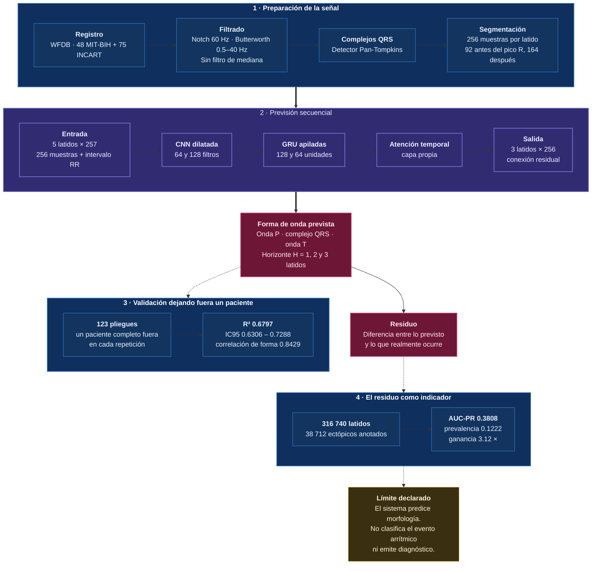

<p align="center">
  
</p>

<p align="center">
  
</p>

<p align="center">
  <a href="https://www.python.org/"></a>
  <a href="https://www.tensorflow.org/"></a>
  <a href="https://fastapi.tiangolo.com/"></a>
  <a href="https://react.dev/"></a>
  <a href="https://www.typescriptlang.org/"></a>
  <a href="https://vite.dev/"></a>
  <a href="https://www.docker.com/"></a>
  <a href="https://physionet.org/"></a>
  <a href="#licencia"></a>
</p>

<p align="center">
  <a href="#demo"><b>Demostración</b></a> &nbsp;·&nbsp;
  <a href="#equipo"><b>Equipo</b></a> &nbsp;·&nbsp;
  <a href="#resumen"><b>Resumen</b></a> &nbsp;·&nbsp;
  <a href="#datos"><b>Datos</b></a> &nbsp;·&nbsp;
  <a href="#fases"><b>Experimentos</b></a> &nbsp;·&nbsp;
  <a href="#resultados"><b>Resultados</b></a> &nbsp;·&nbsp;
  <a href="#arquitectura"><b>Arquitectura</b></a> &nbsp;·&nbsp;
  <a href="#instalacion"><b>Instalación</b></a> &nbsp;·&nbsp;
  <a href="#licencia"><b>Licencia</b></a>
</p>

---

<a id="demo"></a>

##  Demostración en vivo

| | |
| :--- | :--- |
| **Tablero interactivo** | **[ecg-forecasting.vercel.app](https://ecg-forecasting.vercel.app)** |
| **Servicio de inferencia** | [Estado del servicio](https://evoshell-api-ecg-forecasting.hf.space/api/health) · [Documentación de la API](https://evoshell-api-ecg-forecasting.hf.space/docs) |

El tablero recorre las ocho fases experimentales y ejecuta el modelo final sobre registros reales, latido a latido. El módulo **Predicción LOPO** pide la previsión al servicio y la superpone sobre la señal que efectivamente ocurre.

> [!NOTE]
> El servicio de inferencia se aloja en el nivel gratuito de Hugging Face y se suspende tras un periodo sin visitas. Si la primera petición tarda, está arrancando: vuelva a intentarlo en unos segundos. Las demás vistas del tablero no dependen del servicio y cargan de inmediato.

---

<a id="equipo"></a>

##  Equipo de investigación

<table align="center" width="100%">
  <tr align="center">
    <td width="33%" align="center">
      <br><br>
      <b>Darwin David Burbano Guerrero</b><br>
      <sub>Autor · Preprocesamiento de señal y evaluación</sub><br><br>
      <a href="https://github.com/EvoShell"></a>
    </td>
    <td width="34%" align="center">
      <br><br>
      <b>Universidad CESMAG</b><br>
      <sub>Facultad de Ingeniería · Ingeniería de Sistemas</sub><br>
      <sub>San Juan de Pasto, Nariño, Colombia · 2025–2026</sub><br><br>
      
    </td>
    <td width="33%" align="center">
      <br><br>
      <b>Darío Esteban Gómez Ordóñez</b><br>
      <sub>Autor · Aprendizaje profundo y servicio de inferencia</sub><br><br>
      <a href="https://github.com/gomezdevx"></a>
    </td>
  </tr>
</table>

<p align="center">
  <sub>Grupo de Investigación TECNOFILIA · Línea de Tecnologías de la Información y la Comunicación · Sublínea de Inteligencia Artificial</sub>
</p>

---

<a id="resumen"></a>

##  Resumen del proyecto

Este repositorio contiene el sistema de investigación y la plataforma interactiva de un trabajo de grado sobre **previsión de la morfología de la señal de electrocardiograma**.

El problema no se aborda como una clasificación posterior al evento, sino como una **tarea de previsión temporal y morfológica**: a partir del historial de $L = 5$ latidos y de la dinámica de los intervalos RR, el modelo estima la forma de onda completa de los $H \in \\{1, 2, 3\\}$ latidos siguientes.

> [!IMPORTANT]
> **Qué hace el sistema, y qué no.** El modelo **predice la morfología de la señal futura; no clasifica el evento arrítmico** ni emite diagnóstico. Su salida es la forma de onda prevista y el error entre esa previsión y la señal real.
>
> La octava fase experimental demuestra que ese error **sí concentra los latidos ectópicos**: alcanza un AUC-PR de 0.3808 sobre una prevalencia de 0.1222, es decir una ganancia de **3.12 veces** sobre el azar. Pero con una precisión mediana entre pacientes de 0.3123, **no es un detector de uso clínico**, y no se presenta como tal.
>
> Este software **no es un dispositivo médico** y no debe emplearse para tomar decisiones asistenciales. Véase el [aviso legal](#licencia).

<a id="flujo"></a>

###  Flujo metodológico

<p align="center">
  
</p>

<details>
<summary><b>Ver el flujo en detalle, con los parámetros reales del sistema</b></summary>
<br>



</details>

---

<a id="datos"></a>

##  Bases de datos

| Base de datos | Composición | Papel en la investigación |
| :--- | :--- | :--- |
| **[MIT-BIH Arrhythmia Database](https://physionet.org/content/mitdb/1.0.0/)** | 48 registros de dos canales, unos 30 minutos cada uno · 360 Hz · anotaciones de cardiólogo | Entrenamiento y evaluación sobre latidos normales, ectopia ventricular y supraventricular, y bloqueos de rama. |
| **[St. Petersburg INCART Database](https://physionet.org/content/incartdb/1.0.0/)** | 75 registros de doce derivaciones, unos 30 minutos cada uno · 257 Hz | Validación independiente y prueba de generalización entre poblaciones distintas. |

Ambas son de acceso público en PhysioNet y se emplean **como datos de entrada**: no se redistribuyen en este repositorio. Las condiciones de uso y las citas exigidas constan en el [apartado de licencia](#licencia).

---

<a id="fases"></a>

##  Fases experimentales

El trabajo se estructura en ocho cuadernos, en `notebooks/`:

| | Archivo | Enfoque |
| :---: | :--- | :--- |
| **1** | `01_tradicionales.ipynb` | Aprendizaje automático clásico: regresión lineal, árboles, Random Forest, SVR, MLP, ARIMA y la línea base de persistencia. |
| **2** | `02_deep_learning.ipynb` | Arquitecturas profundas: LSTM, GRU, CNN-LSTM y CNN-GRU univariante. |
| **3** | `03_evaluation.ipynb` | Protocolo de evaluación, transferencia cruzada entre pacientes y contraste entre paradigmas. |
| **4** | `04_compuesta multi-sujeto.ipynb` | Entrenamiento multi-sujeto y comparación de **tres cadenas de filtrado**: `F_N+MED`, `F_MED` y `F_N+PB+MED`. |
| **5** | `05_cross_patient.ipynb` | Validación **dejando fuera un paciente** (LOPO), para impedir fuga de información entre entrenamiento y prueba. |
| **6** | `06_Cross_patient_MultiStep.ipynb` | Modelo final: **CNN-GRU con atención temporal**, horizonte $H = 3$, entrada de 256 muestras más el intervalo RR normalizado. |
| **7** | `07_hiperparametros.ipynb` | Búsqueda sistemática de hiperparámetros: veinte configuraciones por arquitectura. |
| **8** | `08_deteccion_evento.ipynb` | El residuo de la previsión como indicador de evento, contrastado con la anotación del cardiólogo. |

---

<a id="resultados"></a>

##  Resultados

Modelo final **CNN-GRU con atención**, validado dejando fuera un paciente sobre **123 registros** (48 de MIT-BIH y 75 de INCART). Cada cifra procede de `results/NB5/resultados_lopo.csv`.

| Métrica | Modelo base | Modelo calibrado |
| :--- | :---: | :---: |
| Coeficiente de determinación $R^2$ | 0.6734 | **0.6797** |
| Intervalo de confianza del 95 % | [0.6235, 0.7233] | [0.6306, 0.7288] |
| Correlación de forma | 0.8383 | **0.8429** |
| RMSE | 0.5139 | **0.5085** |
| Deformación dinámica del tiempo | 0.1355 | **0.1326** |
| Pliegues con $R^2 \ge 0.80$ | 42.3 % | **43.1 %** |

**El residuo como indicador de evento** (octava fase, sobre 316 740 latidos de los que 38 712 son ectópicos):

| | |
| :--- | :---: |
| AUC-PR del residuo | 0.3808 |
| Prevalencia de ectopia | 0.1222 |
| Ganancia sobre el azar | **3.12 ×** |
| Precisión mediana entre pacientes | 0.3123 |

> La ganancia de 3.12 veces sostiene que el error de previsión **no es ruido**: se concentra donde el cardiólogo anotó ectopia. La precisión mediana de 0.3123, y su gran variación entre pacientes, es la razón por la que **no se presenta como detector clínico**.

---

<a id="metricas"></a>

##  Métricas empleadas

| Métrica | Qué mide | Por qué se usa aquí |
| :--- | :--- | :--- |
| **$R^2$** | Proporción de varianza explicada | Se calcula en entrenamiento y en prueba para vigilar el sobreajuste, no solo el acierto. |
| **RMSE y MSE** | Error cuadrático de reconstrucción | Cuantifica la desviación de amplitud entre la señal real y la prevista. |
| **MAE** | Error absoluto medio | Error promedio directo sobre la amplitud de la onda. |
| **Correlación de forma** | Semejanza de la forma de onda | Una previsión puede errar la amplitud y conservar la forma; esta métrica separa las dos cosas. |
| **DTW** | Alineamiento temporal no lineal | Evalúa si se preservan las ondas P, el complejo QRS y la onda T aunque haya desplazamiento temporal. |
| **Wilcoxon y Kruskal-Wallis** | Contraste no paramétrico | Comprueba si la mejora frente a la línea base de persistencia es estadísticamente significativa. |

---

<a id="arquitectura"></a>

##  Arquitectura del sistema

El tablero interactivo está en [`FORECASTING ECG - Dashboard/`](./FORECASTING%20ECG%20-%20Dashboard).

<p align="center">
  
</p>

<a id="estructura"></a>

###  Estructura de carpetas

<p align="center">
  
</p>

---

<a id="instalacion"></a>

##  Instalación y uso

### 1. Clonar el repositorio

```bash
git clone https://github.com/EvoShell/FORECASTING-ECG.git
cd FORECASTING-ECG
```

### 2. Entorno para los cuadernos

```bash
python -m venv .venv
# Windows
.venv\Scripts\activate
# Linux o macOS
source .venv/bin/activate

pip install -r requirements.txt
```

Las señales no se incluyen en el repositorio. Para descargarlas de PhysioNet:

```python
import wfdb
wfdb.dl_database('mitdb',    'datos/mit-bih')
wfdb.dl_database('incartdb', 'datos/incart')
```

### 3. Ejecutar el tablero

#### Opción A — Docker Compose

> [!IMPORTANT]
> Requiere Docker Desktop en ejecución y al menos 6 GB de memoria libre. La primera construcción tarda entre cinco y diez minutos porque descarga TensorFlow.

```bash
cd "FORECASTING ECG - Dashboard/ecg_forecast_api"
docker compose up --build
```

| | |
| :--- | :--- |
| Interfaz | [`http://localhost`](http://localhost) |
| Documentación de la API | [`http://localhost:8000/docs`](http://localhost:8000/docs) |
| Estado del servicio | [`http://localhost:8000/api/health`](http://localhost:8000/api/health) |

#### Opción B — Desarrollo local

```bash
# Servicio
cd "FORECASTING ECG - Dashboard/ecg_forecast_api"
pip install -r requirements.txt
uvicorn app.main:app --host 0.0.0.0 --port 8000 --reload
```

```bash
# Interfaz
cd "FORECASTING ECG - Dashboard/ecg-react"
npm install
npm run dev
```

La interfaz queda en [`http://localhost:5173`](http://localhost:5173), con las llamadas a `/api` redirigidas al servicio.

> [!TIP]
> Siete de los ocho módulos del tablero leen sus datos de archivos y funcionan sin el servicio. Solo **Predicción LOPO** lo necesita.

---

<a id="pruebas"></a>

##  Pruebas

```bash
cd "FORECASTING ECG - Dashboard/ecg_forecast_api"
pytest tests/
```

Cubren el preprocesamiento de señal, la segmentación de latidos, la carga del modelo y las rutas del servicio.

---

<a id="licencia"></a>

##  Licencia, uso y aviso legal

### Aviso sobre el uso

> [!CAUTION]
> **Este software no es un dispositivo médico.** Se desarrolló con fines exclusivamente académicos y de investigación. No está certificado por ninguna autoridad sanitaria, no ha sido validado clínicamente y **no debe emplearse para diagnosticar, tratar ni tomar decisión asistencial alguna**.
>
> El modelo predice la morfología de la señal; no clasifica el evento arrítmico. Cualquier interpretación clínica de sus salidas corre por cuenta de quien la haga.

### Datos biomédicos

Las dos bases proceden de **PhysioNet** y se publican bajo la **[Open Data Commons Attribution License v1.0](https://opendatacommons.org/licenses/by/1-0/)** (ODC-BY 1.0), que **exige atribución**. En cumplimiento de esa condición se citan:

> Moody GB, Mark RG. *The impact of the MIT-BIH Arrhythmia Database.* IEEE Engineering in Medicine and Biology 20(3):45–50, 2001. PMID 11446209. <https://doi.org/10.13026/C2F305>

> Pollard T, Moody BE, Lehman L, Gow B, Fernandes C, Xie C, Johnson A, Mark RG, Heldt T. *PhysioNet as a global platform for biomedical research.* Nature Health, 2026. <https://doi.org/10.1038/s44360-026-00096-z>

Las señales **no se redistribuyen** en este repositorio: se descargan de PhysioNet con las órdenes del apartado de instalación. Los registros están anonimizados en origen y no contienen datos que identifiquen a ninguna persona.

### Código

El código de este repositorio es obra de sus autores y se encuentra en **proceso de inscripción en el Registro Nacional del Derecho de Autor** de Colombia, conforme al Decreto 1360 de 1989, que reconoce el soporte lógico como creación del dominio literario.

Hasta que esa inscripción concluya y quede resuelta la titularidad conforme al Reglamento de Propiedad Intelectual de la Universidad CESMAG, **se reservan todos los derechos**. No se concede licencia de uso, copia, modificación ni distribución. Para cualquier uso, escriba a los autores.

Marco aplicable: Ley 23 de 1982 sobre derecho de autor, Decisión Andina 351 de 1993 y Decreto 1360 de 1989.

### Bibliotecas de terceros

El sistema se apoya en bibliotecas de código abierto que **conservan sus propias licencias** y no quedan cubiertas por lo anterior. Las principales:

| Biblioteca | Licencia |
| :--- | :--- |
| TensorFlow | Apache 2.0 |
| React, React DOM, React Router, Zustand, Plotly.js, Framer Motion | MIT |
| Lucide | ISC |
| SciPy, pandas, HTTPX | BSD |
| WFDB | MIT |
| OGL | Unlicense |

El detalle completo consta en `package.json` y en los archivos `requirements.txt`.

### Trabajo académico

Trabajo de grado del Programa de Ingeniería de Sistemas, **Universidad CESMAG**, San Juan de Pasto, Nariño, Colombia, 2025–2026. Grupo de Investigación TECNOFILIA.

---

<p align="center">
  <sub>Las cifras de este documento proceden de los archivos de resultados del propio repositorio y son reproducibles ejecutando los cuadernos.</sub>
</p>
