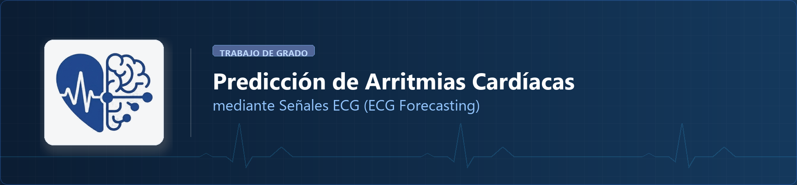
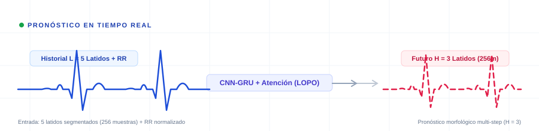
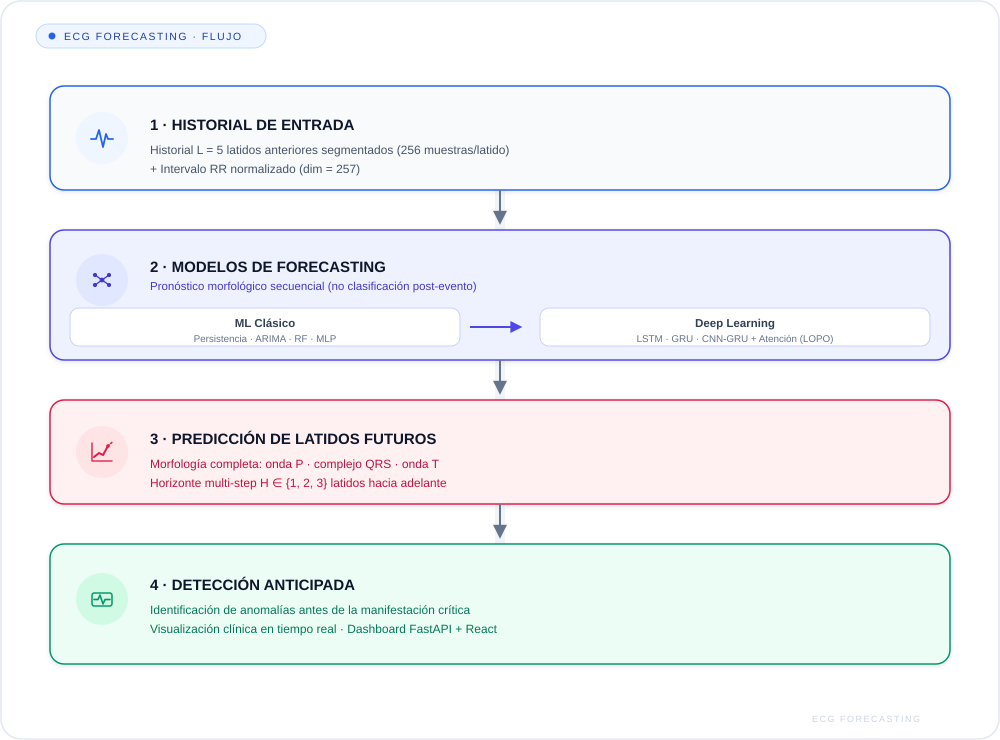
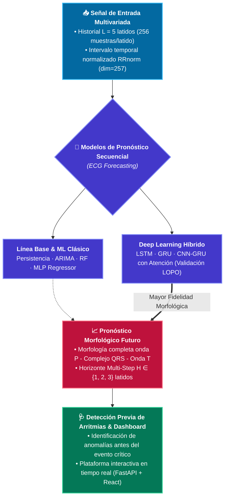
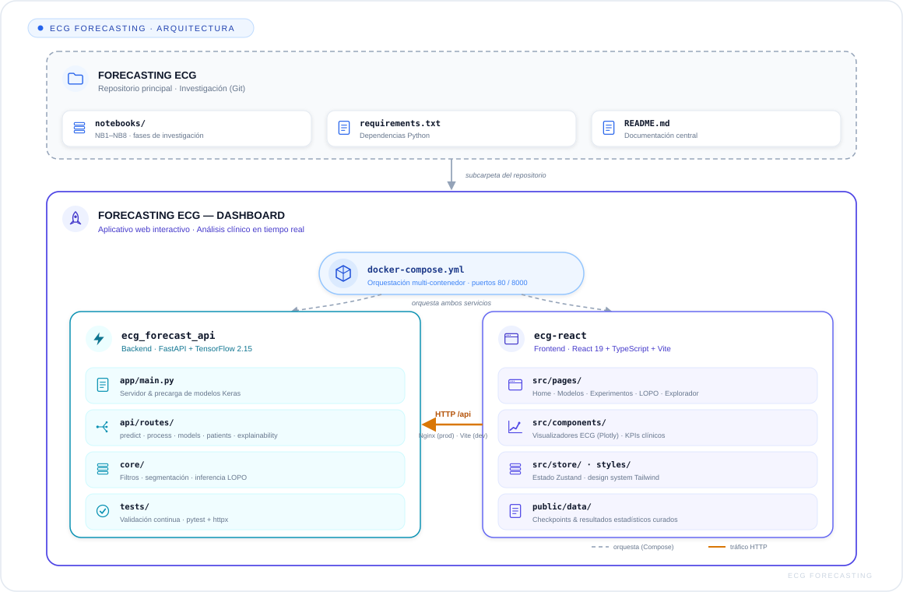
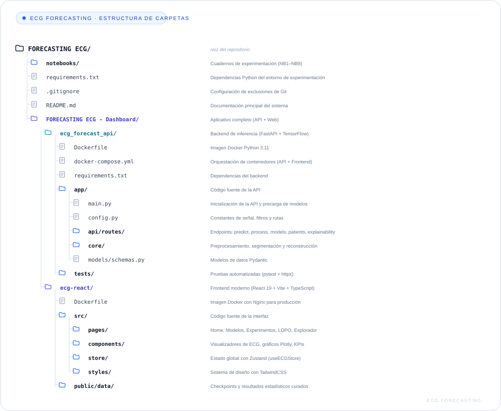

<p align="center">
  
</p>

<p align="center">
  
</p>


<p align="center">
  <a href="https://www.python.org/"></a>
  <a href="https://www.tensorflow.org/"></a>
  <a href="https://fastapi.tiangolo.com/"></a>
  <a href="https://react.dev/"></a>
  <a href="https://www.typescriptlang.org/"></a>
  <a href="https://vitejs.dev/"></a>
  <a href="https://www.docker.com/"></a>
  <a href="https://physionet.org/"></a>
  <a href="#-licencia-y-reconocimientos"></a>
</p>

<p align="center">
  <a href="#-resumen-del-proyecto"><b>Resumen</b></a> •
  <a href="#-bases-de-datos-utilizadas"><b>Bases de Datos</b></a> •
  <a href="#-fases-de-investigación-notebooks"><b>Notebooks</b></a> •
  <a href="#-métricas-de-evaluación-clínica-y-estadística"><b>Métricas</b></a> •
  <a href="#-arquitectura-del-software-dashboard"><b>Arquitectura</b></a> •
  <a href="#-guía-de-instalación-y-uso"><b>Instalación</b></a> •
  <a href="#-pruebas-unitarias-del-backend"><b>Pruebas</b></a> •
  <a href="#-equipo-de-investigación"><b>Equipo</b></a> •
  <a href="#-licencia-y-reconocimientos"><b>Licencia</b></a>
</p>

---

## 👥 Equipo de Investigación

<table align="center" width="100%">
  <tr align="center">
    <td width="33%" align="center">
      <br><br>
      <b>Darwin David Burbano Guerrero</b><br>
      <sub>Investigador Principal · Preprocesamiento & ML</sub><br><br>
      <a href="https://github.com/EvoShell"></a>
    </td>
    <td width="34%" align="center">
      <br><br>
      <b>Universidad CESMAG</b><br>
      <sub>Facultad de Ingeniería · Ingeniería de Sistemas (2025–2026)</sub><br><br>
      
    </td>
    <td width="33%" align="center">
      <br><br>
      <b>Darío Esteban Gómez Ordóñez</b><br>
      <sub>Investigador Principal · Deep Learning & API</sub><br><br>
      <a href="https://github.com/gomezdevx"></a>
    </td>
  </tr>
</table>

---

## 🫀 Resumen del Proyecto

Este repositorio contiene el sistema integral de investigación y la plataforma interactiva para el **pronóstico anticipado (*forecasting*) de señales de electrocardiograma (ECG)** con el objetivo de predecir arritmias cardíacas antes de su manifestación crítica.

A diferencia de los enfoques convencionales de clasificación post-evento, este sistema aborda el problema como una tarea de **pronóstico temporal y morfológico secuencial**: predice la morfología de latidos futuros completos ($H \in \{1, 2, 3\}$ latidos hacia adelante) a partir del historial previo ($L = 5$ latidos), integrando la morfología de la señal y la dinámica de los intervalos RR.

### 🔄 Esquema del Flujo Metodológico de Pronóstico

<p align="center">
  
</p>

<details>
<summary><b>🔧 Ver código fuente del diagrama (Mermaid, editable)</b></summary>



</details>

---

## 🗄️ Bases de Datos Utilizadas

| Base de Datos | Fuente | Especificaciones Clínicas | Propósito en la Investigación |
| :--- | :---: | :--- | :--- |
| **[MIT-BIH Arrhythmia Database](https://physionet.org/content/mitdb/1.0.0/)** | `PhysioNet` | • 48 registros de pacientes (2 canales, ~30 min)<br>• Frecuencia de muestreo: $F_s = 360\text{ Hz}$<br>• Anotaciones clínicas de referencia | Entrenamiento principal, evaluación de latidos normales y arritmias (ventriculares, supraventriculares, bloqueos de rama). |
| **[St. Petersburg INCART Database](https://physionet.org/content/incartdb/1.0.0/)** | `PhysioNet` | • 75 registros de 12 derivaciones (~30 min)<br>• Frecuencia de muestreo: $F_s = 257\text{ Hz}$<br>• Validación independiente | **Validación cruzada independiente y pruebas de generalización inter-paciente** para descartar sesgos poblacionales. |

---

## 🔬 Fases de Investigación (Notebooks)

El núcleo científico del proyecto se encuentra estructurado en 8 cuadernos Jupyter numerados cronológicamente:

| Notebook | Nombre del Archivo | Etapa Metodológica | Enfoque y Descripción |
| :---: | :--- | :---: | :--- |
| **NB1** | `01_tradicionales.ipynb` |  | Modelos de Machine Learning clásico: Regresión Lineal, Árboles de Decisión, Random Forest, SVR, MLP Regressor, ARIMA y línea base de Persistencia. |
| **NB2** | `02_deep_learning.ipynb` |  | Modelos de Deep Learning recurrentes y convolucionales: LSTM, GRU, CNN-LSTM y CNN-GRU univariante. |
| **NB3** | `03_evaluation.ipynb` |  | Protocolo de evaluación estandarizada, análisis de transferencia cruzada y escenarios clínicos. |
| **NB4** | `04_compuesta multi-sujeto.ipynb` |  | Experimentación multi-paciente comparando 7 variantes de preprocesamiento y filtrado (`F_N+MED`, `F_MED`, `F_N+PB+MED`). |
| **NB5** | `05_cross_patient.ipynb` |  | Validación inter-paciente rigurosa mediante **Leave-One-Patient-Out (LOPO)** para prevenir fuga de información (*data leakage*). |
| **NB6** | `06_Cross_patient_MultiStep.ipynb` |  | Modelo multi-step ($H=3$) híbrido **CNN-GRU con mecanismo de Atención**, incorporando latido (256 muestras) + intervalo $RR_{\text{norm}}$ ($\text{dim}=257$). |
| **NB7** | `07_hiperparametros.ipynb` |  | Búsqueda sistemática y optimización de hiperparámetros (tasas de aprendizaje, filtros CNN, unidades recurrentes, regularización). |
| **NB8** | `08_deteccion_evento.ipynb` |  | Análisis y detección de eventos arrítmicos sobre las señales pronosticadas vs. reales. |

---

## 📊 Métricas de Evaluación Clínica y Estadística

| Métrica | Definición / Uso | Relevancia Clínica y Diagnóstica |
| :--- | :--- | :--- |
| **$R^2$ (Coeficiente de Determinación)** | Proporción de varianza explicada por el modelo | Evaluado en entrenamiento y prueba para verificar generalización estricta y evitar sobreajuste. |
| **RMSE / MSE** | Error cuadrático medio de reconstrucción | Cuantifica la magnitud de desviación en milivoltios ($\text{mV}$) entre la señal real y la predicha. |
| **MAE** | Error absoluto medio | Mide el error promedio directo en la amplitud morfológica de la onda cardíaca. |
| **DTW (Dynamic Time Warping)** | Alineamiento de secuencias temporales no lineales | Evalúa la similitud morfológica y preservación de la forma de las ondas P, complejo QRS y onda T. |
| **Tests Estadísticos No Paramétricos** | Pruebas de **Wilcoxon** y **Kruskal-Wallis / Mann-Whitney** | Demuestra significancia estadística real de las mejoras obtenidas frente al modelo base de persistencia. |

---

## 🏗️ Arquitectura del Software (Dashboard)

El proyecto cuenta con un aplicativo web interactivo para análisis clínico y demostración en tiempo real ubicado en [`FORECASTING ECG - Dashboard/`](./FORECASTING%20ECG%20-%20Dashboard):

### 🗺️ Diagrama de Arquitectura y Componentes

<p align="center">
  
</p>


<p align="center">
  
</p>


## 🚀 Guía de Instalación y Uso

### 1. Clonar el repositorio

```bash
git clone https://github.com/EvoShell/FORECASTING-ECG.git
cd FORECASTING-ECG
```

### 2. Entorno para los Notebooks de Investigación

Se recomienda crear un entorno virtual con Python 3.10+:

```bash
python -m venv .venv
# En Windows:
.venv\Scripts\activate
# En Linux/macOS:
source .venv/bin/activate

pip install -r requirements.txt
```

#### Descarga de señales PhysioNet (Opcional si se ejecutan notebooks locales):
```python
import wfdb
# Descarga la base de datos MIT-BIH
wfdb.dl_database('mitdb', 'datos/mit-bih')
```

---

### 3. Ejecutar el Dashboard Interactivo

#### Opción A: Despliegue con Docker Compose (Recomendado)

> [!IMPORTANT]
> Requiere **Docker Desktop** instalado y en ejecución (con motor WSL 2 habilitado en Windows) y al menos 6 GB de memoria RAM libre recomendada.

```bash
cd "FORECASTING ECG - Dashboard/ecg_forecast_api"
docker compose up --build
```

Una vez desplegados los contenedores:
* **Frontend Web:** [`http://localhost`](http://localhost) (puerto `80`)
* **Documentación interactiva de la API (Swagger UI):** [`http://localhost:8000/docs`](http://localhost:8000/docs)
* **Verificación de estado (Healthcheck):** [`http://localhost:8000/api/health`](http://localhost:8000/api/health)

#### Opción B: Ejecución en Desarrollo Local (Sin Docker)

1. **Iniciar el Backend:**
   ```bash
   cd "FORECASTING ECG - Dashboard/ecg_forecast_api"
   pip install -r requirements.txt
   uvicorn app.main:app --host 0.0.0.0 --port 8000 --reload
   ```

2. **Iniciar el Frontend:**
   ```bash
   cd "FORECASTING ECG - Dashboard/ecg-react"
   npm install
   npm run dev
   ```
   * Acceder en el navegador a: [`http://localhost:5173`](http://localhost:5173) (Vite configurado con proxy hacia `/api`).

---

## 🧪 Pruebas Unitarias del Backend

Para validar el funcionamiento del preprocesamiento, carga de modelos y endpoints de la API:

```bash
cd "FORECASTING ECG - Dashboard/ecg_forecast_api"
pytest tests/
```

---

## 📄 Licencia y Reconocimientos

* **Proyecto Académico:** Universidad CESMAG (Pasto, Nariño, Colombia), 2025–2026.
* **Bases de datos biomédicas:** Disponibles públicamente por PhysioNet bajo la licencia [Open Data Commons Attribution License v1.0](https://physionet.org/about/licenses/odc-by-10/).